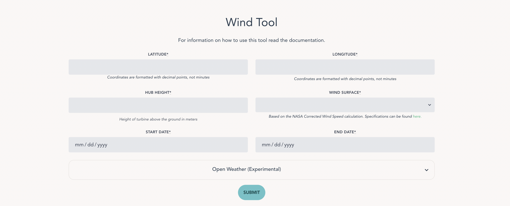
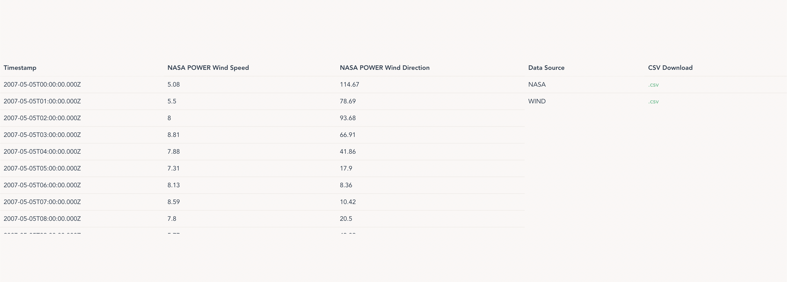

# Communities to Clean API Hub




## Description

A data aggregation platform that combines various data sources to aid in the development of renewable energy. This project is specifically meant to assist local community leaders in making decisions without expensive siting and consultation.

* **Technology Stack**: Backend written in ExpressJS. Front-end created using VueJS framework

* **Status**: Project currently has 5 wind energy resources implemented.

* **Instances**: Demo is currently not hosted

* **Project Purpose**: Although the data that is presented here can also be found in the APIs that this project accesses, this is meant to act as a simplified middle layer that greatly speeds up the process for renewable energy specific applications
  
## Dependencies

* Docker
* nodejs
  * For specific packages check the package.json
* API keys/developer accounts

## Installation

To install the project, simply clone this repository to your computer. If git is installed, navigate to the directory you wish to clone it to and execute this command:

```bash
git clone https://github.com/filip-r-casey/C2C-API-HUB
```

## Usage

In order for the APIs to be accessed properly, many of them require developer keys. For privacy reasons, personal developer keys **should not** be included in this repository. Links to get your own API keys are here:

* [NASA POWER](https://api.nasa.gov/)
* [Wind Toolkit](https://developer.nrel.gov/signup/)
* [Open Weather](https://openweathermap.org/appid)

In order for the application to use these keys, you must create a `.env` file in the "api" directory. Follow this template for it to work properly:

The application can be ran in two ways, both explained below.

### Docker

First ensure that docker is installed on your machine. Then open a terminal window in the project directory

```bash
docker build -t c2c-data-platform-image
docker run -d --name c2c-data-platform
```

This will start the container that runs the web application. To access the app, navigate to [PORT 8080](http://0.0.0.0:8080/)

```txt
NASA_POWER_API_KEY="{API_KEY}"
WIND_TOOLKIT_API_KEY="{API_KEY}"
OPEN_WEATHER_API_KEY="{API_KEY}"
EMAIL="{EMAIL}"
```

### Node.js

If you'd prefer not to use docker, the application can also be run using Node.js. If you don't have Node.js installed, you can install it [here](https://docs.npmjs.com/downloading-and-installing-node-js-and-npm).

1. Navigate to the "api" directory and run the backend

    ```bash
    cd api
    npm run start
    ```

2. Navigate to the "web-app" directory and serve the front-end

    ```bash
    cd ../web-app
    npm run serve
    ```

3. Access the platform at [PORT 8080](http:/0.0.0.0:8080) and the API at [PORT 3080](http:/0.0.0.0:3080)

Note: These services are hosted at different ports, but when a request is made through the front-end, it will proxy all requests with the "/api" endpoint to port 3080, meaning that the data can be accessed through both.

## Testing

Testing is done with the Jest framework, using supertest to make fake API calls. To run tests on your machine, simply run ```npm run start``` in the "api" directory. Otherwise, everytime that a push is made to a branch, the tests will be run automatically through GitHub Actions.

## Documentation

Since the project is not currently hosted, there is nowhere that documentation is easily accessible. Currently, the best way to get access to this, is to run the project on your machine, and access the "api/docs" endpoint. The documentation is done according to Open API standards (PKA Swagger).

## Known Issues

* Wind Toolkit API cannot return a JSON file for data larger than a couple of megabytes, so a download link is provided as a substitute

## Data sources

This app sources information from the following APIS:

* [NASA POWER](https://power.larc.nasa.gov/docs/services/api/)
* [Wind Toolkit](https://www.nrel.gov/grid/wind-toolkit.html)
* [TAP](https://dw-tap.nrel.gov/#api-Wind_Speed)
* [Open Weather](https://openweathermap.org/api) - Support TBD due to cost restrictions
* [National Weather Service](https://www.weather.gov/documentation/services-web-api#/default/station_observation_list)
* [NCEI](https://www.ncei.noaa.gov/support/access-data-service-api-user-documentation)
  
A report on the types of information available from these sources and the assumptions that they make can be found here: [Filip Casey SULI Paper](https://drive.google.com/file/d/10BlTYDYR5AO15iI6XRxVjnxyXnBcUEuk/view?usp=sharing). And a simplified comparison will be included in the website's user interface soon.

## Getting Help

If your question is not answered here email: filip.r.casey@gmail.com
